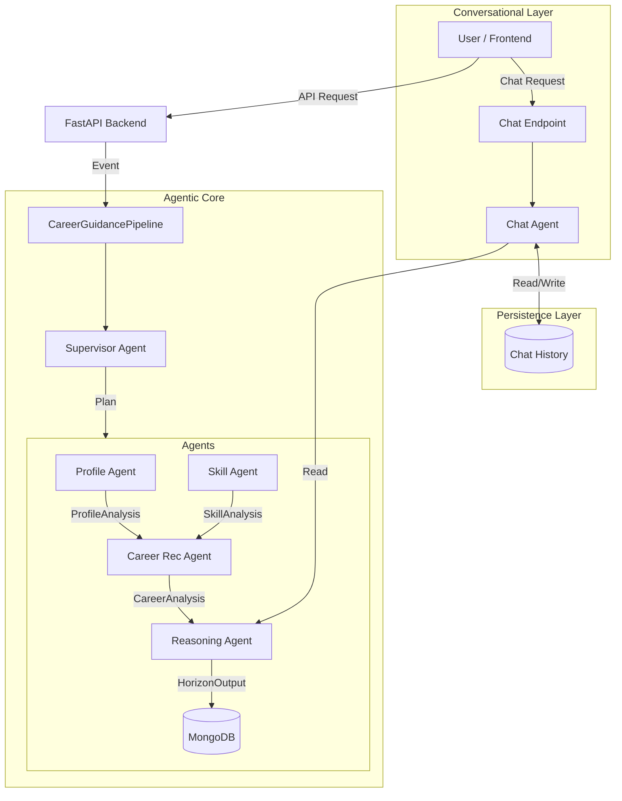

# Career Guidance System — Technical Documentation

## 1. System Overview

The **Career Guidance Agent** is a multi-agent backend system designed to provide personalized career advice to students and professionals. It combines **deterministic rule-based agents** with **LLM-powered reasoning** (Gemini 2.5 Flash) to analyze profiles, identify skill gaps, and suggest career paths.

The system is exposed via a **FastAPI** interface and persists state in **MongoDB**.

---

## 2. Architecture

### High-Level Architecture

The system follows a pipeline architecture coordinated by a Supervisor.



### Components

1.  **API Layer (`api.py`)**: Handles HTTP requests, authentication (Google OAuth/Dev Mode), and lifecycle management.
2.  **Pipeline (`agent.py`)**: Orchestrates agent execution based on events.
3.  **Persistence (`database.py`)**: Async MongoDB connection using `motor`.

---

## 3. Agent System

The backend consists of 5 specialized agents, each with a distinct responsibility.

| Agent               | Responsibility                                   | Type        | Model            |
| ------------------- | ------------------------------------------------ | ----------- | ---------------- |
| **Supervisor**      | Determines execution plan (which agents to run). | Rule-Based  | N/A              |
| **Profile Agent**   | Analyzes user details (stage, time, risk).       | LLM-Powered | Gemini 2.5 Flash |
| **Skill Agent**     | Maps skill dependencies and identifies gaps.     | Graph-Based | N/A              |
| **Career Agent**    | Suggests role directions and market insights.    | LLM-Powered | Gemini 2.5 Flash |
| **Reasoning Agent** | Synthesizes all data into a final roadmap.       | Rule-Based  | N/A              |
| **Chat Agent**      | Context-aware Q&A agent for user guidance.       | LLM-Powered | Gemini 2.5 Flash |

---

## 4. User Flows

### Flow 1: Onboarding

**Goal**: Initialize user profile and generate first roadmap.

1.  **User** submits onboarding form (Role, Interests, Goals).
2.  **API** triggers `ONBOARDING_COMPLETED` event.
3.  **Pipeline** executes full suite:
    - `ProfileAgent`: Infers "Early/Mid/Late" stage.
    - `CareerAgent`: Suggests roles (e.g., "AI Engineer").
    - `SkillAgent`: Checks missing prerequisites.
    - `ReasoningAgent`: Generates `HorizonOutput`.
4.  **Result**: Returns full JSON with Roadmap, Stats, and Insights.

### Flow 2: Career Chat

**Goal**: Answer dynamic questions about the roadmap.

1.  **User** sends message: "How do I start with Python?"
2.  **ChatAgent** retrieves user's `HorizonOutput` (context).
3.  **ChatAgent** queries Gemini 2.5 Flash with system prompt + context.
4.  **ChatAgent** saves conversation to MongoDB `conversations` collection.
5.  **Result**: Returns markdown response + 3 follow-up suggestions.

### Flow 3: Skill Update

**Goal**: Update progress when user learns a new skill.

1.  **User** marks "Python" as "Completed".
2.  **API** triggers `SKILL_UPDATED` event.
3.  **Supervisor** optimizes plan: skips `CareerAgent` if direction hasn't changed.
4.  **SkillAgent** updates dependency graph.
5.  **ReasoningAgent** updates roadmap progress bar and unlocks next steps.

---

## 5. Persistence & Data Models

### MongoDB Collections

- **Database**: `career_guidance`
- **Collections**:
  - `conversations`: Stores chat history (`session_id`, `messages`).
  - _Note: User profiles currently in-memory (extensible to DB)._

### Key Data Objects (Pydantic)

- `UserProfileInput`: Raw user data.
- `HorizonOutput`: The "God Object" sent to frontend (Roadmaps, Stats).
- `ChatRequest`/`ChatResponse`: API contract for chat.

---

## 6. Technology Stack

- **Language**: Python 3.10+
- **Web Framework**: FastAPI (Async)
- **Database Driver**: Motor (Async MongoDB)
- **LLM Provider**: Google Generative AI (Gemini 2.5 Flash)
- **Environment**: Docker / Uvicorn

## 7. Configuration

Required Environment Variables (`.env`):

```bash
GOOGLE_API_KEY=AIzaSy...         # For Gemini
MONGO_URI=mongodb+srv://...      # For Persistence
DEV_MODE=False                   # Auth Toggle
```
